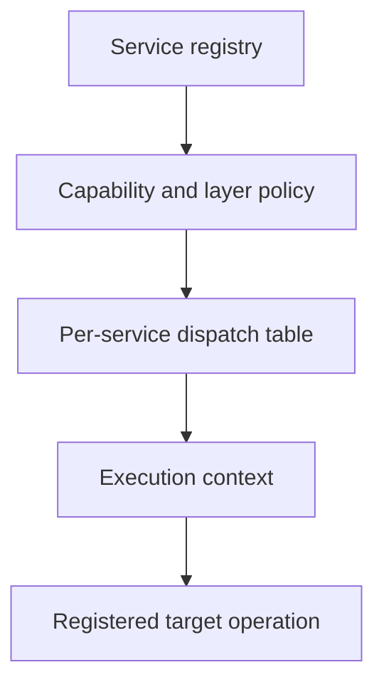
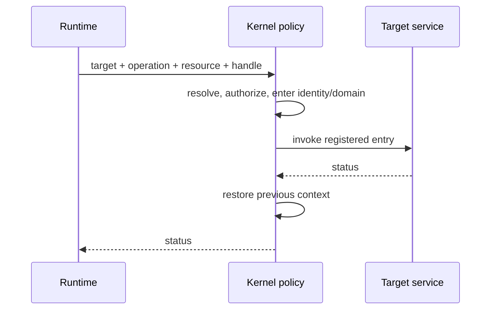

# Lettuce: Reading Guide

## 1. What this project is

Imagine a small organization where departments need to request work from one another. A directory tells you which departments exist, an access card says what a person may request, and a receptionist checks the request before forwarding it. Lettuce is a research operating-system prototype that models this idea with services, capabilities, operation IDs, dispatch tables, and logical protection domains.

This is an educational guide to the code that exists today. It is not a production OS manual and it does not claim that the current C variables provide hardware memory isolation.

## 2. Recommended reading order

1. [00-overview.md](00-overview.md): vocabulary and route through the book; prerequisite: none.
2. [01-project-flow.md](01-project-flow.md): build and source flow; prerequisite: this chapter.
3. [02-service-registry.md](02-service-registry.md): service lookup and lifecycle; prerequisite: project flow.
4. [03-current-service-context.md](03-current-service-context.md): trusted identity and nesting; prerequisite: registry.
5. [04-capability-system.md](04-capability-system.md): authorization handles; prerequisite: identity.
6. [05-dispatcher.md](05-dispatcher.md): operation-to-entry resolution; prerequisite: registry and capabilities.
7. [06-protection-domain.md](06-protection-domain.md): layer versus isolation domain; prerequisite: identity.
8. [07-same-layer-call.md](07-same-layer-call.md): same-layer path; prerequisite: chapters 2-6.
9. [08-cross-layer-call.md](08-cross-layer-call.md): direct cross-layer path; prerequisite: same-layer path.
10. [09-elevator.md](09-elevator.md): critical fast path; prerequisite: cross-layer path.
11. [10-call-message.md](10-call-message.md): compact cross-layer request; prerequisite: communication chapters.
12. [11-rust-runtime.md](11-rust-runtime.md): Rust FFI wrappers; prerequisite: call API.
13. [12-shared-buffer.md](12-shared-buffer.md): fixed shared memory model; prerequisite: capabilities and domains.
14. [13-dynamic-array.md](13-dynamic-array.md): heap-backed circular dynamic-array utility (strictly separated from kernel hot paths); prerequisite: static tables.
15. [14-performance-and-complexity.md](14-performance-and-complexity.md): complexity and measurements; prerequisite: all implementation chapters.
16. [15-end-to-end-walkthrough.md](15-end-to-end-walkthrough.md): Camera to Display; prerequisite: the complete path.
17. [16-glossary.md](16-glossary.md): quick reference; prerequisite: none.

## 3. Mental model

```text
service ID -> registry descriptor -> layer/domain
capability handle -> kernel capability entry -> authorization
(service ID, operation ID) -> per-service table -> function
validated call -> context enter -> target -> context restore
```





## 4. Current Implementation Status

**Implemented in ARM64 Freestanding Prototype:**
- Bootable freestanding ARM64 ELF kernel image (`lettuce-arm64.elf`) running at EL1.
- Synthetic user services executing in thread mode at EL0.
- Hardware MMU page tables (4 KiB translation granules, 39-bit virtual address space).
- 16-bit ASID translation tagging and ASID-aware `TTBR0_EL1` domain switching without broad TLB flushes.
- ARMv8.3-A Pointer Authentication (`pacia`/`autia`) signing supervisor return continuations on the context stack.
- GICv2 interrupt controller driver and ARM Generic Virtual Timer (PPI 27, 100 Hz deterministic tick).
- Decoupled preemptive task scheduler supporting pluggable Round-Robin and fixed-point integer EEVDF policies.
- POSIX-lite syscall layer (`read`, `write`, `close`, `getpid`, `clock_gettime`, `nanosleep`) with user-pointer validation shields.
- Memory-safe Safe Rust user-space runtime SDK (`runtime/rust/`).
- Specialized Elevator ARM64 assembly transition gate (`kernel/arch/arm64/elevator.S`).
- Bounded, statically sized capability directories ($O(1)$ flat tables) and task tables (16 tasks).
- Heap-backed circular `DynamicArray` container under `shared/dynamic_array/` (strictly separated from kernel hot paths; zero dynamic allocation in hot paths).

**Architectural Feature Probing:**
- **MTE (Memory Tagging Extension):** Probed via system ID registers; tag-backed physical RAM is unbacked in the evaluated standard QEMU virt DRAM configuration, making it optional.
- **POE (Permission Overlay Extension):** Probed via ID registers and accurately reported as unsupported on the evaluated CPU target; no fake software emulation is provided.

## Source files used in this chapter

- [CMakeLists.txt](../CMakeLists.txt)
- [kernel/include/kernel.h](../kernel/include/kernel.h)
- [include/lettuce/service.h](../include/lettuce/service.h)
- [include/lettuce/capability.h](../include/lettuce/capability.h)
- [kernel/main/kernel.c](../kernel/main/kernel.c)
