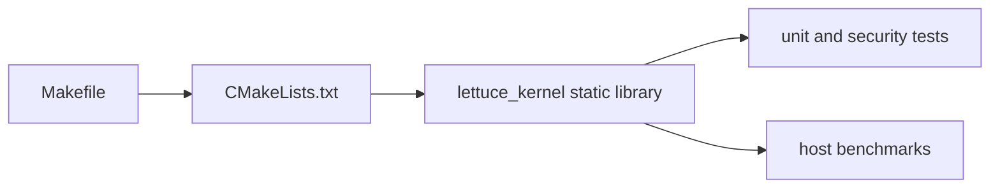
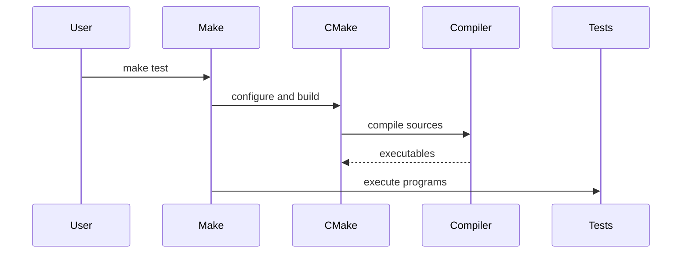

# Project Flow

## 1. What problem does this solve?

A workshop needs both a blueprint and a repeatable build checklist. Lettuce uses CMake to turn the source list into a static library and test/benchmark executables; Make targets provide shorter commands.

## 2. Analogy

CMake is the architect's blueprint. Make is the foreman who says “build, test, benchmark.” The compiler produces the library and small programs; no boot image is currently produced by the root build.

## 3. Where it lives

```text
CMakeLists.txt -> liblettuce_kernel + test/benchmark executables
Makefile       -> configure/build/test/bench/check helpers
scripts/       -> shell equivalents and optional ARM64/QEMU checks
```





## 4. Actual flow

`CMakeLists.txt` compiles kernel main code, same-layer/cross-layer/Elevator code, fixed memory, and C runtime wrappers into `lettuce_kernel`. Tests link against it. `make test` runs each executable; `make bench` runs host timing programs; `cargo check` checks the Rust crate whose library path is `runtime/rust/src/lib.rs`.

The root build uses C23 and strict warnings. `scripts/run-qemu.sh` only reports a skip when QEMU or an ELF is absent; it does not create a kernel image.

## 5. Common misunderstanding

Building the static library is not booting an operating system. The repository is a research prototype with host-executable validation.

## 6. Complexity table

| Action | Complexity | Why |
|---|---:|---|
| CMake configure | build-system dependent | Generates build files |
| Compile | source-size dependent | Compiler work |
| Test execution | test dependent | Runs fixed programs |

## How to remember this subsystem

CMake defines composition. Make defines convenience. Tests prove behavior. Benchmarks measure host behavior. None of these imply ARM64 hardware enforcement.

## Source files used in this chapter

- [CMakeLists.txt](../CMakeLists.txt)
- [Makefile](../Makefile)
- [scripts/test.sh](../scripts/test.sh)
- [scripts/bench.sh](../scripts/bench.sh)
- [scripts/build-arm64.sh](../scripts/build-arm64.sh)
- [scripts/run-qemu.sh](../scripts/run-qemu.sh)
- [Cargo.toml](../Cargo.toml)
