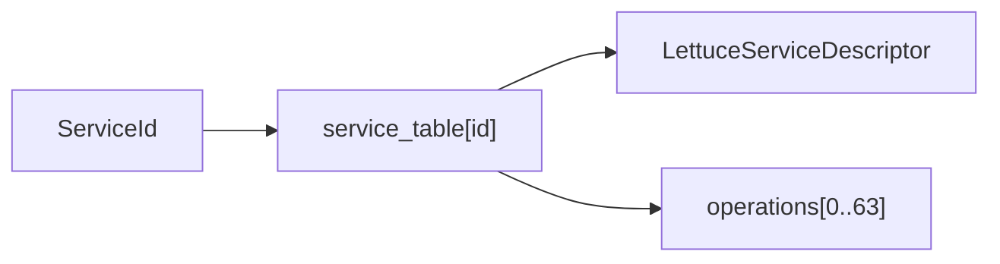
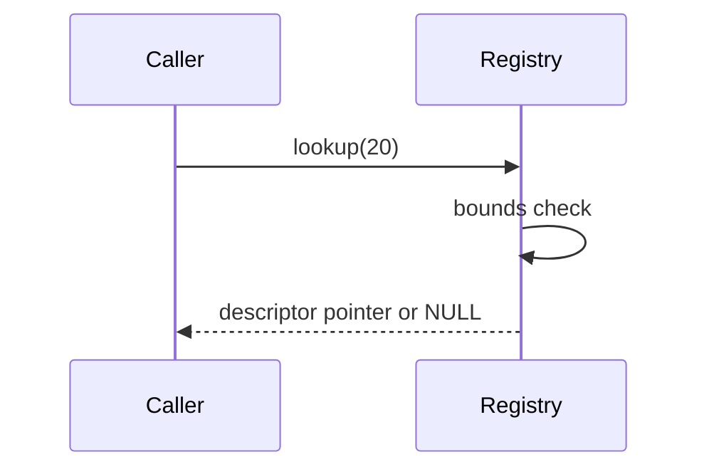

# Service Registry

## 1. What problem does this solve?

A receptionist must answer “does department 20 exist, and is it active?” without asking every department in turn. The service registry is that directory.

## 2. Real-life analogy

A hotel room number points directly to a room record. Lettuce's bounded `LettuceServiceId` works similarly: ID 20 indexes `service_table[20]`.

## 3. Where it lives

- [kernel/main/kernel.c](../kernel/main/kernel.c)
- [kernel/include/kernel.h](../kernel/include/kernel.h)
- [include/lettuce/service.h](../include/lettuce/service.h)

```text
ServiceId 20
    |
    v
service_table[20]
    |
    +-- descriptor: id, layer, domain, flags
    +-- operations[0..63]
```





## 4. Main data structures

`LettuceServiceDescriptor` contains `id` at offset 0, `layer` at 4, three reserved bytes, `domain` at 8, and `flags` at 12. `LettuceServiceRegistryEntry` embeds that descriptor and its per-service dispatch entries. There is no second authoritative active boolean: existence is represented by a nonzero descriptor ID, while `LETTUCE_SERVICE_FLAG_ACTIVE` expresses lifecycle activity.

## 5. Main functions

### `lettuce_service_registry_init()`

Clears all 256 descriptors and 64 operation entries per service. It returns `true`. Complexity is $O(256 \times 64)$ initialization work.

### `lettuce_service_registry_register(LettuceServiceDescriptor descriptor)`

Checks nonzero/bounded ID and valid layer, then writes directly to that slot. It rejects duplicates. Complexity is $O(1)$.

### `lettuce_service_registry_lookup(LettuceServiceId service_id)`

Bounds-checks and returns the descriptor at the direct index if its ID matches. Complexity is $O(1)$.

### `lettuce_service_registry_unregister(LettuceServiceId service_id)`

Clears the descriptor and all operation entries at that index. Complexity is $O(64)$ because it clears the embedded table.

### `lettuce_service_registry_is_active()` and `validate()`

Lookup the descriptor and test `LETTUCE_SERVICE_FLAG_ACTIVE`. Each lookup is $O(1)$.

## 6. Design reason

The ID range is deliberately bounded by `LETTUCE_SERVICE_TABLE_SIZE` (256). This trades a fixed memory footprint for predictable lookup and avoids a hash map or linear scan on communication paths.

## 7. Common misunderstandings

**Same layer means same service.** False: many services may share a layer. **Active means allocated.** Not exactly: a descriptor can exist without its active flag. **Registry lookup grants permission.** False: capabilities and path policy do that.

## How to remember this subsystem

The registry answers who exists. Direct indexing makes the answer predictable. The descriptor identifies classification and domain. The embedded operation array gives dispatch a home.

## Source files used in this chapter

- [kernel/main/kernel.c](../kernel/main/kernel.c)
- [kernel/include/kernel.h](../kernel/include/kernel.h)
- [include/lettuce/service.h](../include/lettuce/service.h)
