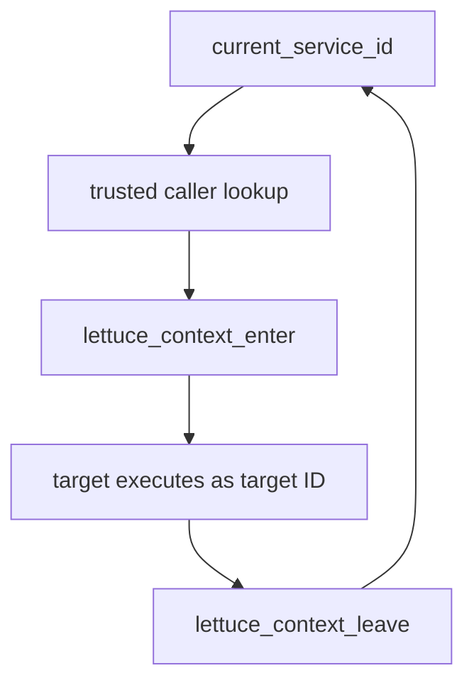
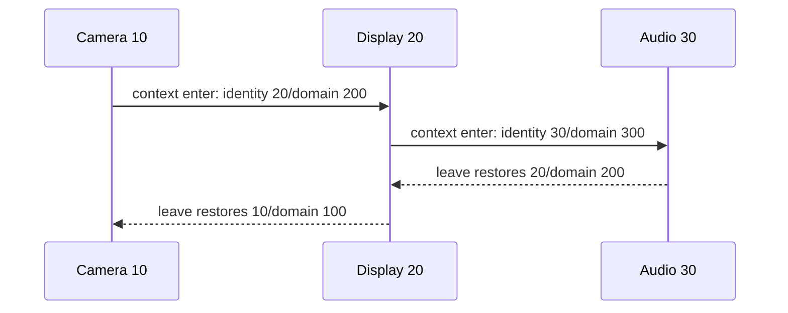

# Current Service Context

## 1. What problem does this solve?

A security desk must know who is currently inside, not trust a visitor who says “I am the manager.” Lettuce uses `current_service_id()` as the kernel's authoritative answer to that question.

## 2. Analogy

A badge reader records the person who entered a room. A nested request temporarily changes the badge context to the target and restores the old badge on return.

## 3. Where it lives

- [kernel/main/context.c](../kernel/main/context.c)
- [kernel/include/context.h](../kernel/include/context.h)
- [kernel/include/kernel.h](../kernel/include/kernel.h)

```text
Camera A / domain 100
        enter B / domain 200
Display B / domain 200
        enter C / domain 300
Audio C / domain 300
        leave -> Display B / domain 200
        leave -> Camera A / domain 100
```





## 4. Main data structures and functions

```c
typedef struct LettuceExecutionContext {
    LettuceServiceId service_id;
    LettuceDomainId domain_id;
} LettuceExecutionContext;
```

`current_service_id()` reads the current service variable. `kernel_set_current_service_id()` writes it through the kernel-named setter. `lettuce_context_enter(target_service_id, target_domain_id)` stores the old service/domain in an automatic return value, sets the target identity, and enters its domain. `lettuce_context_leave(previous_context)` restores domain then identity.

The previous context lives in the caller's C stack frame, so nesting depth is bounded by the call stack rather than a manually allocated global stack. Gates invoke this pair only after validation succeeds.

## 5. Trust boundary

The runtime can request a target ID, but it does not get to define the authoritative caller. Capability checks read `current_service_id()`. The context transition itself is kernel-private.

## 6. Common misunderstanding

A C variable is not hardware authentication. It models the intended trusted context in this prototype; a real kernel would tie it to scheduler/entry machinery.

## Complexity table

| Function | Complexity |
|---|---:|
| `current_service_id` | $O(1)$ |
| `lettuce_context_enter` | $O(1)$ |
| `lettuce_context_leave` | $O(1)$ |

## How to remember this subsystem

Identity answers “who is executing now?” Domain answers “which protection context is active?” A nested call changes both and must restore both.

## Source files used in this chapter

- [kernel/main/context.c](../kernel/main/context.c)
- [kernel/include/context.h](../kernel/include/context.h)
- [kernel/main/protection.c](../kernel/main/protection.c)
