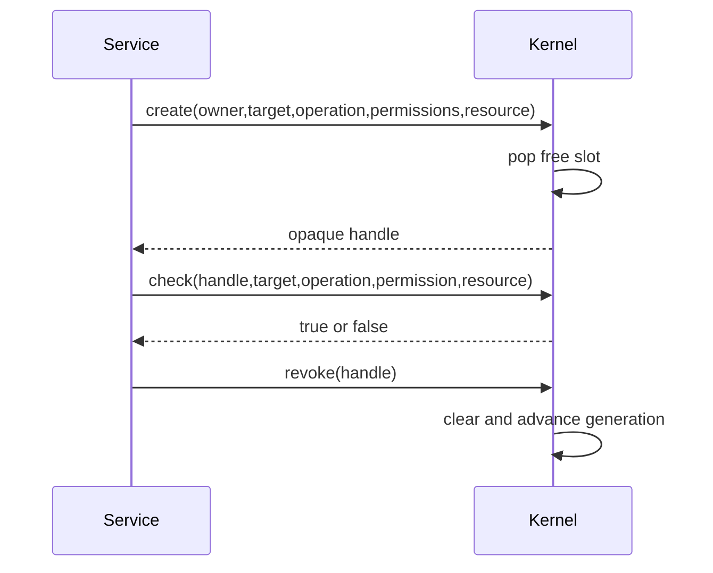
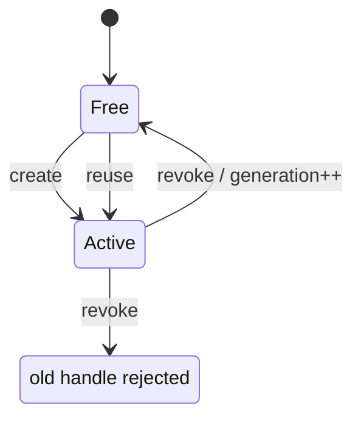

# Capability System

## 1. What problem does this solve?

An access card should say exactly which room, action, and resource it permits. Possessing a card number alone should not reveal or change the security office's record.

## 2. Analogy

A key-card number identifies a record in a locked security database. The drawer number is the slot; its version is the generation. When a card is revoked and the drawer is reused, the old number becomes stale.

## 3. Where it lives

- [kernel/main/capability.c](../kernel/main/capability.c)
- [kernel/include/capability_internal.h](../kernel/include/capability_internal.h)
- [include/lettuce/capability.h](../include/lettuce/capability.h)

```text
handle = generation << 16 | (slot + 1)
capability_table[slot] -> owner, target, operation, resource, permissions
```






## 4. Main data structure

```c
typedef struct LettuceCapabilityEntry {
    LettuceServiceId owner;
    LettuceServiceId target;
    LettuceOperationId operation;
    LettuceResourceId resource;
    uint32_t permissions;
    uint16_t generation;
    bool active;
} LettuceCapabilityEntry;
```

The entry is 24 bytes under the current ABI/alignment rules. `permissions` is a bitmask such as `LETTUCE_CAP_CALL`; the exact logical operation is a separate field.

The handle currently uses 16 bits for `(slot + 1)` and 16 bits for generation. Although 4096 slots need only 12 slot bits, this milestone deliberately leaves the existing handle ABI unchanged.

## 5. Main functions

### `lettuce_capability_init()`
Clears entries, sets generation to 1, and fills the static free-slot stack. Initialization is $O(n)$ for 4096 entries.

### `lettuce_capability_create(owner, target, operation, permissions, resource)`
Rejects invalid IDs/operation/resource or unknown permission bits, pops one free slot, writes metadata, marks it active, and returns an opaque handle. Complexity is $O(1)$.

### `lettuce_capability_check(handle, target, operation, permission, resource)`
Decodes the handle, directly reads its slot, checks active/generation, reads trusted `current_service_id()`, then compares owner, target, operation, resource, and permission mask. It has no loop, allocation, hash, or string operation: $O(1)$.

### `lettuce_capability_revoke(handle)`
Rejects malformed/stale/inactive handles, clears metadata, increments generation, and pushes the slot back exactly once. Complexity is $O(1)$.

## 6. Common misunderstandings

A handle does not contain all permission metadata; it references kernel storage. A slot is not two objects at once; generation distinguishes reuse over time. `CALL` does not mean every operation: operation ID must match exactly. Authorization is not memory isolation.

## Complexity table

| Function | Complexity |
|---|---:|
| init | $O(n)$ |
| create | $O(1)$ |
| check | $O(1)$ |
| revoke | $O(1)$ |
| decode | $O(1)$ |

## How to remember this subsystem

The handle is a ticket. The entry is the security record. Generation defeats stale tickets. Exact fields prevent a valid ticket for one request from becoming permission for another.

## Source files used in this chapter

- [include/lettuce/capability.h](../include/lettuce/capability.h)
- [kernel/include/capability_internal.h](../kernel/include/capability_internal.h)
- [kernel/main/capability.c](../kernel/main/capability.c)
