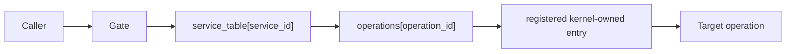
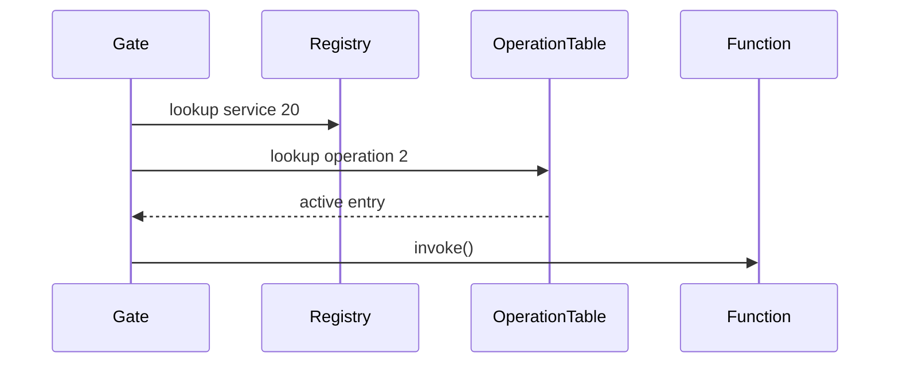
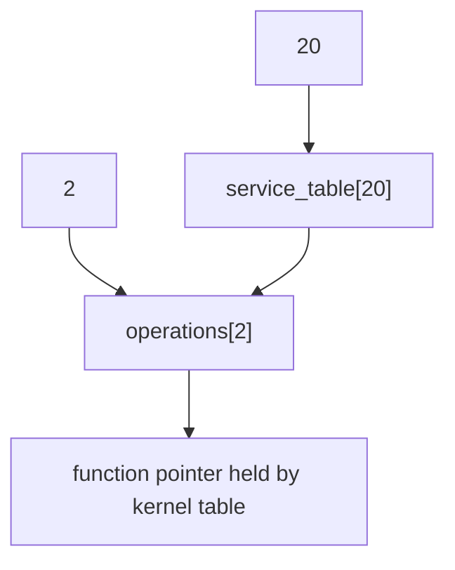

# Dispatcher

## 1. What problem does this solve?

A restaurant ticket should name menu item 2, not tell a customer to hand the kitchen an arbitrary address. The kitchen owns the mapping from item number to action. Lettuce dispatch does the same for service operations.

## 2. Where it lives

- [kernel/main/dispatch.c](../kernel/main/dispatch.c)
- [kernel/include/kernel.h](../kernel/include/kernel.h)

```text
service_table[20]
    -> operations[2]
        -> entry function + active bit
```







## 3. Main data structures

```c
typedef struct LettuceDispatchEntry {
    LettuceStatus (*entry)(void);
    bool active;
} LettuceDispatchEntry;
```

`entry` is a kernel-registered function pointer; `active` says whether that operation exists. It is not part of the public service descriptor ABI. `LettuceServiceRegistryEntry` embeds 64 of these entries after its 16-byte descriptor, so its conceptual size is $16 + 64 \times sizeof(LettuceDispatchEntry)$; the compiler determines pointer/bool padding on the host.

## 4. Functions

### `lettuce_dispatch_register(service_id, operation_id, entry)`

Rejects invalid IDs, operation IDs outside 0..63, missing target service, or null entry. It writes the entry directly into the target service's operation table. Complexity is $O(1)$.

### `lettuce_dispatch_lookup(service_id, operation_id)`

Bounds-checks the operation and returns the active per-service entry, or `NULL`. Complexity is $O(1)$.

### `lettuce_dispatch_unregister(service_id, operation_id)`

Clears one operation entry directly. Complexity is $O(1)$.

## 5. Full flow and design reason

Validation resolves the entry once into `LettuceCallResolution`; the gate reuses that pointer. The caller supplies IDs, never a raw function address. This prevents an arbitrary-address call request and removes the old global scan. Registration depends on a registered service, so an operation cannot float independently of its owner.

Unknown operations are rejected before invocation. Same-layer, cross-layer, and Elevator all use the same dispatch lookup after their distinct policy checks.

## 6. Common misunderstandings

A function pointer exists, but it is stored in kernel-owned registration state. “Dispatch” does not mean dynamic arbitrary call. `active` on an operation is not capability authorization; it only says that a callable registration exists.

## Complexity table

| Function | Complexity | Reason |
|---|---:|---|
| register | $O(1)$ | direct service/operation index |
| lookup | $O(1)$ | direct service/operation index |
| unregister | $O(1)$ | direct slot clear |

## How to remember this subsystem

IDs choose. The kernel table resolves. Policy authorizes. Only then does the stored entry run.

## Source files used in this chapter

- [kernel/main/dispatch.c](../kernel/main/dispatch.c)
- [kernel/include/kernel.h](../kernel/include/kernel.h)
- [ipc/same_layer/validate.c](../ipc/same_layer/validate.c)
- [ipc/cross_layer/call.c](../ipc/cross_layer/call.c)
- [ipc/elevator/policy.c](../ipc/elevator/policy.c)
