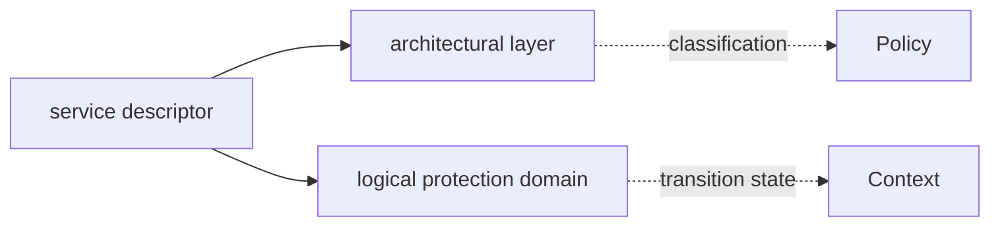
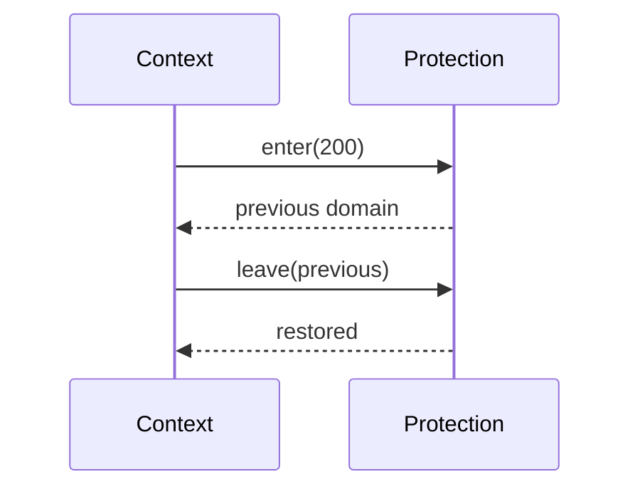

# Protection Domain

## 1. What problem does this solve?

Two teams can work on the same organizational floor while occupying separate locked offices. The floor is classification; the office is the security boundary. Lettuce calls these layer and domain.

## 2. Where it lives

- [kernel/include/protection.h](../kernel/include/protection.h)
- [kernel/main/protection.c](../kernel/main/protection.c)
- [kernel/include/context.h](../kernel/include/context.h)

```text
Camera:  layer L3, domain 100
Display: layer L3, domain 200
Same layer != same domain
```





## 3. Actual implementation

`g_current_domain` is a static `LettuceDomainId`. `lettuce_protection_enter(target_domain)` returns the old value, assigns the target if nonzero, and issues a compiler memory barrier. `lettuce_protection_leave(previous_domain)` restores the value and issues another barrier. `lettuce_protection_current_domain()` exposes the model for tests.

`LettuceExecutionContext` pairs this domain with service identity so gates do not manage the two pieces independently.

## 4. Real versus emulated

**REAL NOW:** the domain ID is passed through kernel-owned C control flow and restored on return. **EMULATED NOW:** no page tables, MMU permissions, POE instruction, PAC, or MTE tag enforcement changes. **STATUS: NOT IMPLEMENTED YET:** hardware-backed transitions.

A domain is not authorization. Capabilities decide whether a request is allowed; domains model where execution is logically running.

## Complexity table

| Function | Complexity |
|---|---:|
| enter | $O(1)$ |
| leave | $O(1)$ |
| current | $O(1)$ |

## Common misunderstandings

Same-layer services do not share a domain. Changing a C variable does not isolate memory. Layer does not imply routing through intermediate layers.

## How to remember this subsystem

Layer tells you category. Domain tells you logical room. Capability grants the request. Hardware enforcement is future work.

## Source files used in this chapter

- [include/lettuce/service.h](../include/lettuce/service.h)
- [kernel/include/protection.h](../kernel/include/protection.h)
- [kernel/main/protection.c](../kernel/main/protection.c)
- [kernel/include/context.h](../kernel/include/context.h)
