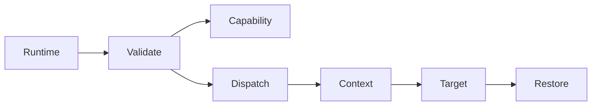
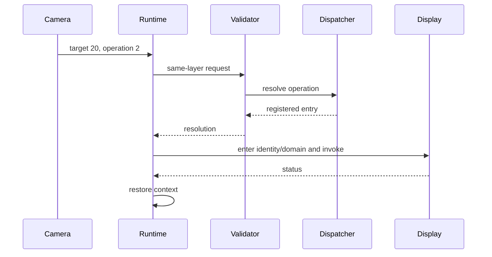
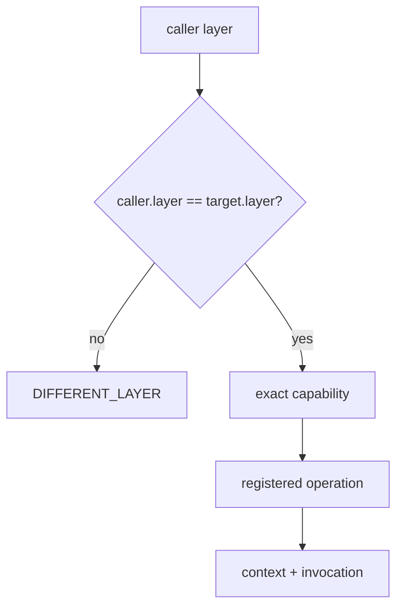

# Same-Layer Call

## 1. Problem

Two departments on one organizational floor still need separate authorization and rooms. “Same floor” must not become “call anything.”

## 2. Analogy

Camera and Display are both on floor L3, but a receptionist checks the badge, requested menu item, resource, and destination before sending the request to Display's office.

## 3. Where it lives

- [runtime/c/same_layer_call.c](../runtime/c/same_layer_call.c)
- [ipc/same_layer/validate.c](../ipc/same_layer/validate.c)
- [ipc/same_layer/gate.c](../ipc/same_layer/gate.c)

```text
runtime -> validate -> resolution -> context enter -> entry -> context leave
```







## 4. Functions

`lettuce_same_layer_call(target, operation, resource, capability)` is the public runtime wrapper and forwards to `lettuce_same_layer_gate()`.

`lettuce_same_layer_validate()` obtains trusted current identity, resolves caller and target descriptors, checks active state and equal layers, validates IDs, checks the exact capability, and resolves the operation into `LettuceCallResolution`. It returns a `LettuceStatus`; complexity is $O(1)$.

`lettuce_same_layer_gate()` validates first, enters target identity/domain using `lettuce_context_enter()`, calls the already-resolved entry, then always calls `lettuce_context_leave()`. Target errors are returned after restoration.

## 5. Example

Camera 10/L3/domain 100 calls Display 20/L3/domain 200, operation 2, resource 300. A capability must contain owner 10, target 20, operation 2, resource 300, and `CALL`. Operation 1 with the same handle is denied.

## Common misunderstandings

Same-layer is not a direct function call, and it does not allow a caller pointer. Validation failures happen before context mutation. A denied call does not need restoration because no transition occurred.

## Complexity table

| Stage | Complexity |
|---|---:|
| wrapper | $O(1)$ |
| validation | $O(1)$ |
| dispatch | $O(1)$ |
| context transition | $O(1)$ |

## How to remember this subsystem

Same layer is a policy condition, not a trust shortcut. IDs select, capabilities authorize, dispatch resolves, context transitions, and restoration closes the call.

## Source files used in this chapter

- [runtime/c/same_layer_call.c](../runtime/c/same_layer_call.c)
- [ipc/same_layer/validate.c](../ipc/same_layer/validate.c)
- [ipc/same_layer/gate.c](../ipc/same_layer/gate.c)
- [kernel/main/context.c](../kernel/main/context.c)
