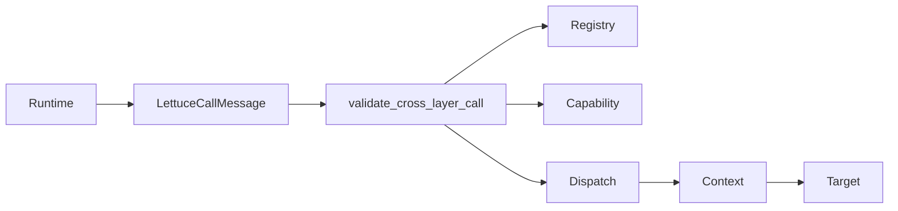
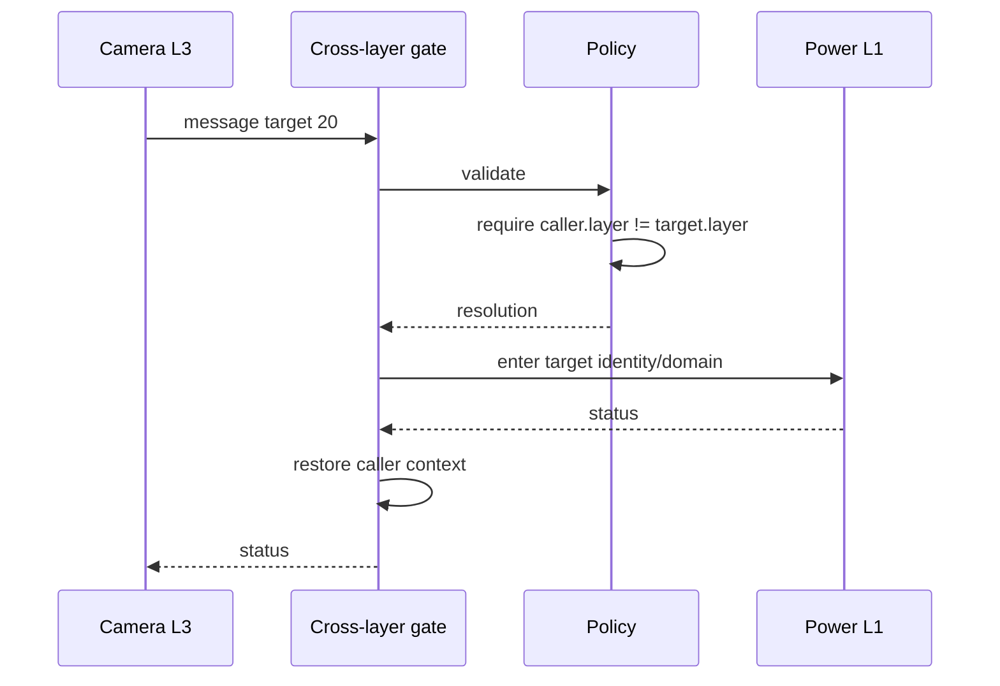

# Cross-Layer Call (Stairs)

## 1. Problem

A department may need a permitted service in another category. The categories classify departments; they are not mandatory elevator stops.

## 2. Analogy

Camera on floor/category L3 can request Power Manager on L1 directly if its access card permits it. It does not have to ask L2 to forward the request.

## 3. Where it lives

- [include/lettuce/message.h](../include/lettuce/message.h)
- [runtime/c/cross_layer_call.c](../runtime/c/cross_layer_call.c)
- [ipc/cross_layer/call.c](../ipc/cross_layer/call.c)
- [ipc/cross_layer/message.c](../ipc/cross_layer/message.c)

```text
message -> cross-layer policy -> capability -> dispatch -> context -> target
```





## 4. Functions and flow

`lettuce_cross_layer_call()` is the runtime wrapper. `lettuce_cross_layer_gate()` validates the non-null message, trusted caller, active target, unequal layers, valid IDs, exact `CALL` capability, and registered entry. It stores one `LettuceCallResolution`, enters target context, invokes the entry, and restores context.

An equal-layer request is rejected with `LETTUCE_STATUS_INVALID_STATE`; it must use the same-layer path. Complexity is $O(1)$ because service and operation access are bounded direct indexes.

## 5. Common misunderstandings

Cross-layer does not mean multi-hop routing. L3 to L1 is direct. It is also not automatically more privileged than same-layer; capability authorization remains required.

## Complexity table

| Stage | Complexity |
|---|---:|
| message validation | $O(1)$ |
| registry/dispatch | $O(1)$ |
| capability check | $O(1)$ |
| context transition | $O(1)$ |

## How to remember this subsystem

Different layer selects the Stairs route. The target is direct. The same capability, dispatch, and context disciplines still apply.

## Source files used in this chapter

- [ipc/cross_layer/call.c](../ipc/cross_layer/call.c)
- [ipc/cross_layer/message.c](../ipc/cross_layer/message.c)
- [runtime/c/cross_layer_call.c](../runtime/c/cross_layer_call.c)
- [include/lettuce/message.h](../include/lettuce/message.h)
