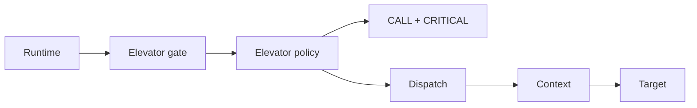
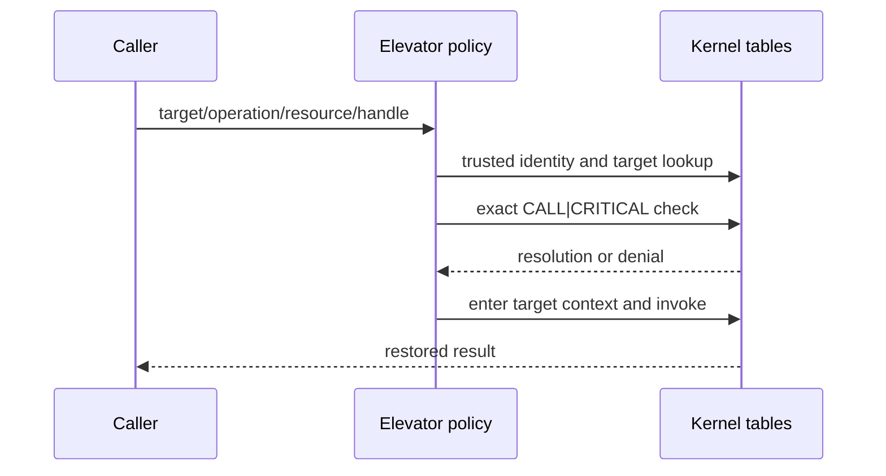
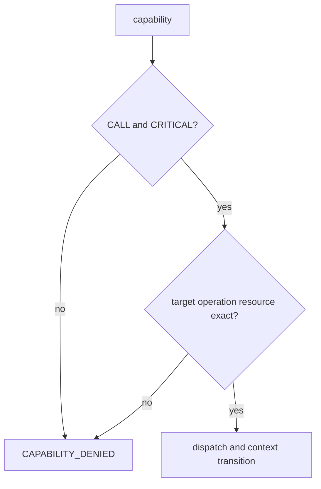

# Elevator Call

## 1. Problem

An express route should not be available to everyone with an ordinary transit ticket. Lettuce's Elevator path is a specially gated call requiring explicit critical authorization.

## 2. Analogy

A building's emergency express lift accepts a badge with both “enter” and “emergency operator” privileges. A normal badge is insufficient.

## 3. Where it lives

- [ipc/elevator/policy.c](../ipc/elevator/policy.c)
- [ipc/elevator/elevator.c](../ipc/elevator/elevator.c)
- [runtime/c/elevator_call.c](../runtime/c/elevator_call.c)

```text
message -> critical policy -> exact CALL|CRITICAL capability
         -> dispatch -> context -> target -> restore
```







## 4. Functions

`lettuce_elevator_call()` forwards to `lettuce_elevator_gate()`. `lettuce_elevator_policy()` checks message/outputs, active caller and target, valid operation/resource, and `lettuce_capability_check(..., LETTUCE_CAP_CALL | LETTUCE_CAP_CRITICAL, ...)`, then resolves the target operation. The gate enters `LettuceExecutionContext`, invokes the entry, and restores it even for an error status.

The path is direct and $O(1)$ for policy, capability, dispatch, and context operations. The current implementation is a portable C fallback; [kernel/arch/arm64/elevator.S](../kernel/arch/arm64/elevator.S) is not a completed transition implementation.

## Common misunderstandings

Critical permission is not blanket access to MAIN or an entire layer. Elevator is not a replacement for capability checks. It does not imply real hardware privilege escalation.

## Source files used in this chapter

- [ipc/elevator/policy.c](../ipc/elevator/policy.c)
- [ipc/elevator/elevator.c](../ipc/elevator/elevator.c)
- [runtime/c/elevator_call.c](../runtime/c/elevator_call.c)
- [include/lettuce/capability.h](../include/lettuce/capability.h)
