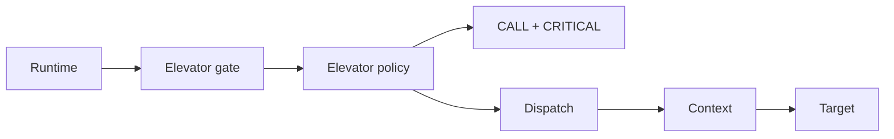
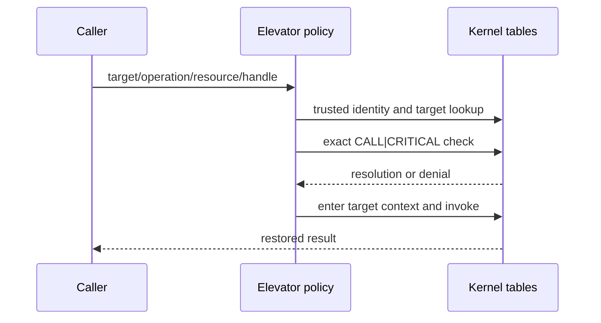
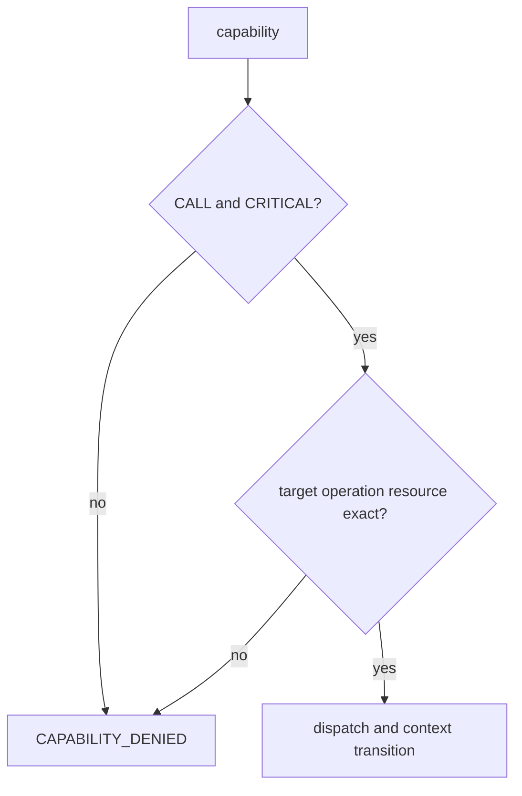

# Elevator Call

## 1. Problem

An express route should not be available to everyone with an ordinary transit ticket. Lettuce's Elevator path is a specially gated call requiring explicit critical authorization.

## 2. Analogy

A building's emergency express lift accepts a badge with both “enter” and “emergency operator” privileges. A normal badge is insufficient.

## 3. Where it lives

- [ipc/elevator/policy.c](../ipc/elevator/policy.c)
- [ipc/elevator/elevator.c](../ipc/elevator/elevator.c)
- [runtime/c/elevator_call.c](../runtime/c/elevator_call.c)

```text
message -> critical policy -> exact CALL|CRITICAL capability
         -> dispatch -> context -> target -> restore
```







## 4. Architecture and Separation of Concerns

The Elevator transition enforces strict separation between authorization policy and hardware transition mechanisms:

### C Supervisor (Authorization Policy)
- Authoritatively resolves the caller identity from supervisor execution context (`current_service_id`).
- Validates the target service, requested operation ID, and resource ID.
- Enforces capability authorization requiring both `LETTUCE_CAP_CALL` and `LETTUCE_CAP_CRITICAL` permissions.
- Prepares a validated `LettuceElevatorDescriptor` containing the target entry PC, target stack pointer (`SP_EL0`), and target `TTBR0_EL1` with its 16-bit ASID.

### ARM64 Assembly (`kernel/arch/arm64/elevator.S`)
- Implements `lettuce_elevator_asm_transition()`.
- Performs the direct hardware `TTBR0_EL1` switch preceded by `dsb ish` and followed by `isb`.
- Programs the target EL0 entry PC, `SP_EL0`, and return state into the trap frame.
- **Pure transition mechanism:** The assembly gate does NOT perform authorization and cannot bypass capability checks; it consumes state produced only after C policy validation succeeds.

## 5. Empirical Evaluation

The Elevator assembly gate is evaluated against the reference C transition path across two distinct datasets:

### Reference ARM64 QEMU Run (Evidence Class 3)
- **Case H (C Reference Elevator):** p50 = 14,913 Generic Counter ticks.
- **Case J (Assembly-Specialized Elevator):** p50 = 14,407 Generic Counter ticks.
- In this specific reference run under QEMU TCG, the assembly path measured a 3.39% lower median latency and 3.13% lower mean latency.

### Five-Host Reproducibility Matrix (Evidence Class 4)
- When executing the identical guest ELF across five heterogeneous host environments under QEMU TCG, the relative ordering between Case H and Case J is **not invariant** across environments (e.g., on macOS ARM64 Case J measured 14,300 ticks vs. 15,100 ticks for Case H, while on local Linux x86_64 Case J measured 15,996 ticks vs. 15,430 ticks for Case H).
- Accordingly, Lettuce documents the assembly gate as an experimentally evaluated specialization rather than claiming a universal performance advantage over the C reference path.

## Common misunderstandings

Critical permission is not blanket access to MAIN or an entire layer. Elevator is not a replacement for capability checks; it requires both `LETTUCE_CAP_CALL` and `LETTUCE_CAP_CRITICAL`. The assembly transition does not bypass authorization or grant arbitrary privilege escalation.

## Source files used in this chapter

- [ipc/elevator/policy.c](../ipc/elevator/policy.c)
- [ipc/elevator/elevator.c](../ipc/elevator/elevator.c)
- [kernel/arch/arm64/elevator.S](../kernel/arch/arm64/elevator.S)
- [runtime/c/elevator_call.c](../runtime/c/elevator_call.c)
- [include/lettuce/capability.h](../include/lettuce/capability.h)
