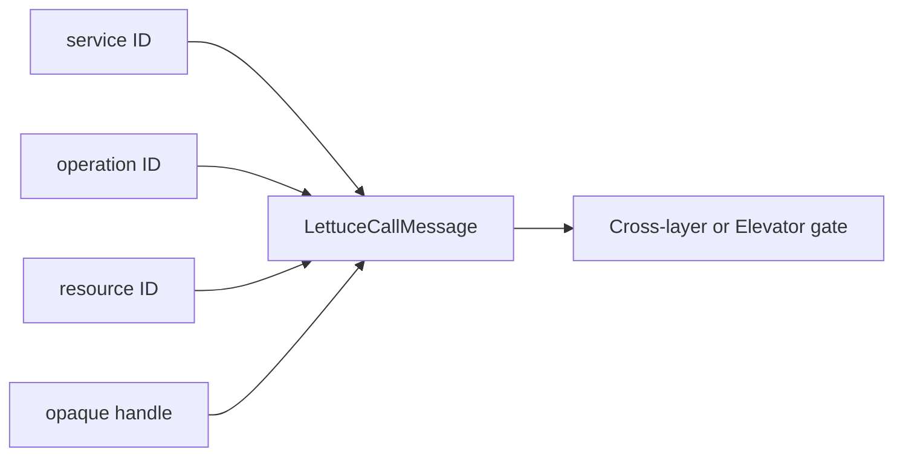
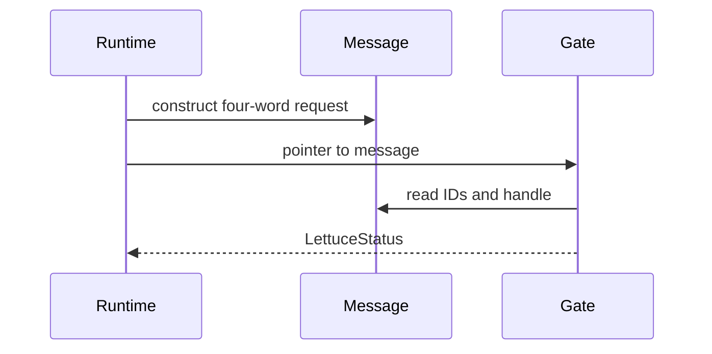

# Call Message

## 1. Problem

A shipping label should contain compact identifiers, not executable addresses or a copied payload. LettuceCallMessage carries the authorization request for cross-layer and Elevator calls.

## 2. Actual type

```c
typedef struct LettuceCallMessage {
    LettuceServiceId target_service_id;
    LettuceOperationId operation_id;
    LettuceResourceId resource_id;
    LettuceCapabilityHandle capability_handle;
} LettuceCallMessage;
```

```text
offset 0   target service       4 bytes
        4   operation ID        4 bytes
        8   resource ID         4 bytes
       12   capability handle   4 bytes
       16   total
```





## 3. Design reason

The message has no caller ID: caller identity comes from kernel context. It has no function pointer: dispatch resolves one from kernel-owned tables. It has no string operation name: operation IDs are compact fixed-width values.

`message.c` contains a size assertion. The type is 16 bytes with ordinary 4-byte members and no packing directive. This is an ABI-friendly request, but a pointer to it is still only safe while its storage remains valid; the current host path does not serialize or copy it.

## 4. Common misunderstandings

The message is a request, not proof of permission. A valid-looking handle still undergoes generation, owner, target, operation, resource, and permission checks.

## Complexity table

| Action | Complexity |
|---|---:|
| construct/read fields | $O(1)$ |
| message size | 16 bytes |
| authorization | see capability chapter |

## How to remember this subsystem

Four words identify the requested action. The kernel supplies identity and resolves code. The message never grants access by itself.

## Source files used in this chapter

- [include/lettuce/message.h](../include/lettuce/message.h)
- [ipc/cross_layer/message.c](../ipc/cross_layer/message.c)
- [ipc/cross_layer/call.c](../ipc/cross_layer/call.c)
- [runtime/c/cross_layer_call.c](../runtime/c/cross_layer_call.c)
