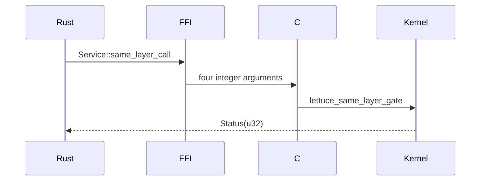

# Rust Runtime

## 1. Problem

A C kernel boundary is powerful but easy to misuse. A Rust wrapper can make handles and IDs distinct types while keeping authorization in C.

## 2. Analogy

The kernel is a vault; Rust is a clerk who carries a numbered request form. The clerk may format the request, but the vault still decides whether it is allowed.

## 3. Where it lives

- [runtime/rust/src/lib.rs](../runtime/rust/src/lib.rs)
- [runtime/rust/src/service.rs](../runtime/rust/src/service.rs)
- [runtime/rust/src/capability.rs](../runtime/rust/src/capability.rs)
- [runtime/rust/src/buffer.rs](../runtime/rust/src/buffer.rs)
- [Cargo.toml](../Cargo.toml)

```text
Rust Service -> unsafe extern C declaration -> C runtime -> kernel gate
```




## 4. Actual types

`CapabilityHandle` and `ServiceId` are `#[repr(transparent)]` wrappers around `u32`. `Status` is also a transparent `u32` wrapper. `Service::same_layer_call()` calls the C symbol with raw integers. `Buffer::access()` calls the C shared-buffer symbol and receives a raw pointer and size.

The `unsafe extern "C"` declaration describes a foreign ABI; the call is unsafe because Rust cannot prove the C implementation's behavior. The public Rust methods are safer in shape, but the current Buffer wrapper does not expose the returned pointer and does not yet model lifetimes.

## 5. Important boundary note

Rust does not reimplement kernel security. Capability validation, identity, dispatch, and domain transitions remain C-side. `cargo check` validates Rust syntax/types, not that a linked Rust executable exists.

## Common misunderstandings

`repr(transparent)` does not make an FFI call safe. A handle wrapper is not a capability grant. Rust ownership cannot automatically prove a C pointer's lifetime.

## Complexity table

| Wrapper | Complexity |
|---|---:|
| integer conversion | $O(1)$ |
| C call | depends on selected path |
| Rust compile check | source-size dependent |

## Source files used in this chapter

- [runtime/rust/src/lib.rs](../runtime/rust/src/lib.rs)
- [runtime/rust/src/service.rs](../runtime/rust/src/service.rs)
- [runtime/rust/src/capability.rs](../runtime/rust/src/capability.rs)
- [runtime/rust/src/buffer.rs](../runtime/rust/src/buffer.rs)
