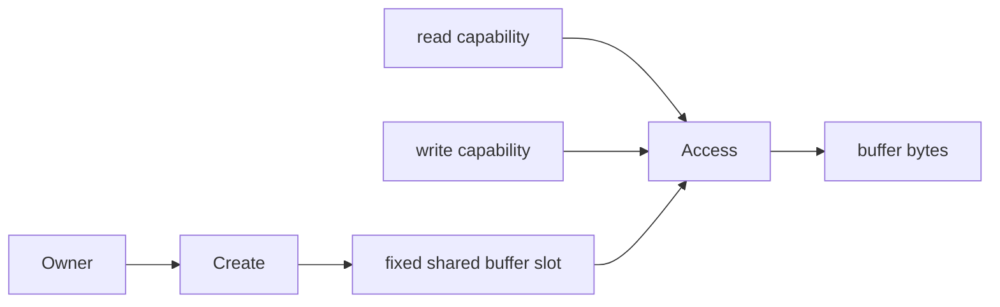
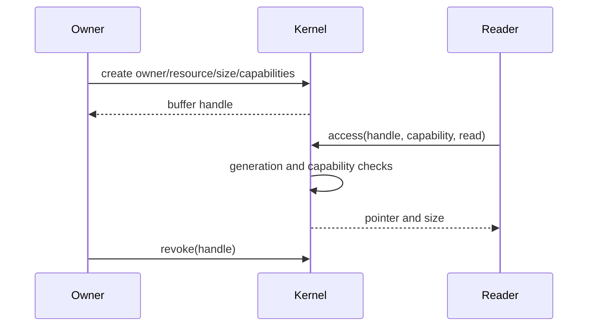

# Shared Buffer

## 1. Problem

Passing a large box through a tiny mail slot is inefficient. A shared buffer lets authorized parties use a known storage area while the request message carries only a handle and metadata.

## 2. Analogy

A warehouse assigns a crate to an owner and issues reader/writer passes. Losing or revoking a pass must stop access, even if the crate number is reused.

## 3. Where it lives

- [include/lettuce/memory.h](../include/lettuce/memory.h)
- [memory/shared/buffer.c](../memory/shared/buffer.c)
- [runtime/c/shared_buffer.c](../runtime/c/shared_buffer.c)
- [runtime/rust/src/buffer.rs](../runtime/rust/src/buffer.rs)

```text
buffer handle -> slot + generation -> owner/resource/size
                                  -> read capability or write capability
```





## 4. Actual implementation

There are 16 static `SharedBuffer` slots, each with owner, resource, size, read/write handles, generation, active bit, and a 4096-byte data array. `create()` requires the current service to equal owner. `access()` decodes the handle, checks active/generation, requires the supplied handle to equal the configured read/write handle, then calls `lettuce_capability_check()` with synthetic read/write operation IDs `0x100` and `0x101`. `revoke()` clears activity and advances generation.

The code is fixed-size and deterministic. It is not a general shared-memory manager, and `runtime/c/shared_buffer.c` is currently a placeholder rather than an alternate implementation.

## Common misunderstandings

“Shared” does not mean globally writable. The pointer returned by C is only meaningful under the current model; real page permissions are not changed. Revocation prevents the API access path, not arbitrary host pointer use after a pointer has already escaped.

## Complexity table

| Function | Complexity |
|---|---:|
| init | $O(16)$ |
| create | $O(16)$ slot search |
| access | $O(1)$ |
| revoke | $O(1)$ |

## How to remember this subsystem

A buffer has an owner, resource identity, explicit read/write tickets, lifetime, and generation. The current mechanism is a research API, not hardware isolation.

## Source files used in this chapter

- [include/lettuce/memory.h](../include/lettuce/memory.h)
- [memory/shared/buffer.c](../memory/shared/buffer.c)
- [runtime/c/shared_buffer.c](../runtime/c/shared_buffer.c)
- [runtime/rust/src/buffer.rs](../runtime/rust/src/buffer.rs)
