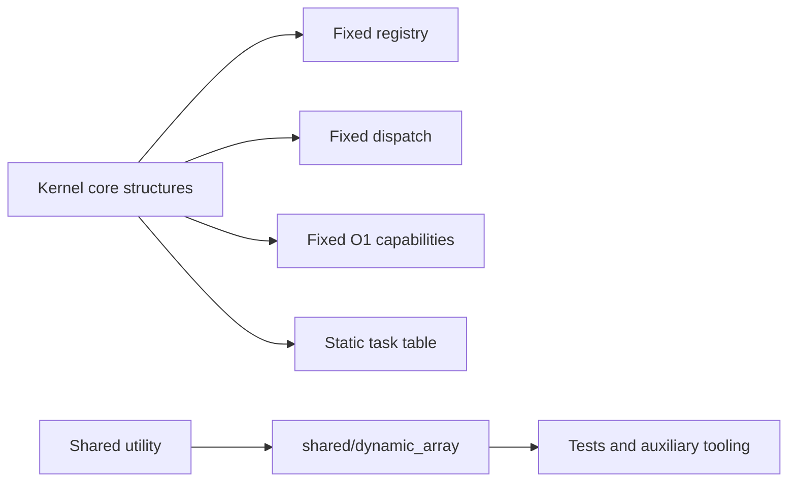
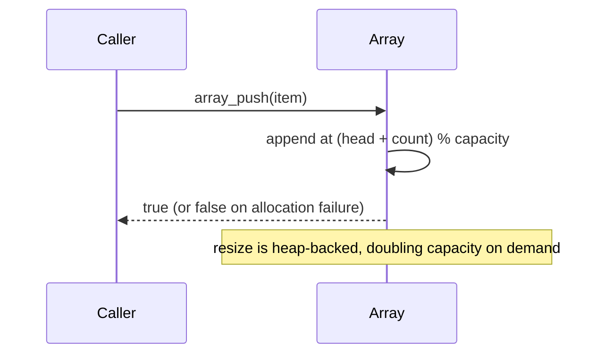

# Dynamic Array Utility

## 1. What problem does this solve?

A fixed filing cabinet is predictable; a growing container can accommodate dynamically sized non-hot-path workloads. Lettuce provides a circular dynamic array utility for non-kernel utilities, testing infrastructure, and user-space tooling.

## 2. Actual Project Status

The repository provides a generic circular `DynamicArray` under `shared/dynamic_array/` (`dynamic_array.h` and `dynamic_array.c`), verified by `dynamic_array_unit.c`.

**Architectural Placement:**
- It is a **generic/shared utility** intended for user-space tools, testing harnesses, and auxiliary runtimes.
- It is **strictly excluded from kernel communication hot paths**.
- Fixed service registry, dispatch, capability, and task table structures in the kernel remain bounded, statically dimensioned, and predictable.
- Dynamic heap allocation is never introduced into interrupt handlers, context switching, scheduling loops, or capability mediation paths.

```text
Kernel hot paths (EL1 / IPC):
fixed registry / fixed dispatch / fixed capability / static task tables
                         |
                         +-- strictly separated
                         |
Auxiliary / tooling usage:
shared DynamicArray utility (malloc/free backed, heap circular buffer)
```





## 3. Implementation Semantics

The circular dynamic array in [shared/dynamic_array/dynamic_array.h](../shared/dynamic_array/dynamic_array.h) manages elements via `head`, `count`, `capacity`, and a `void **data` buffer:
- **Indexing:** `array_get()` and `array_set()` calculate index offsets modulo capacity in $O(1)$ time with bounds validation (`index < count`).
- **Stack / Queue Operations:** `array_push()`, `array_pop()`, `array_enqueue()`, and `array_dequeue()` operate in $O(1)$ amortized time.
- **Growth & Allocation:** When `count == capacity`, `resize()` allocates double the capacity (`ARRAY_GROWTH_FACTOR = 2`) via `malloc()`, copies elements in logical `0..count` order, and frees the previous buffer.
- **Graceful Failure Handling:** Unlike older drafts, the implementation **never terminates the process or calls `exit(EXIT_FAILURE)`**. Allocation failures and arithmetic overflow guards return `NULL` (from `array_init()`) or `false` (from `array_push()`, `array_enqueue()`, `array_set()`), leaving caller recovery explicit.

## Common misunderstanding

A DynamicArray is not a replacement for kernel static tables. Because its resize operations invoke dynamic memory allocation and copying, it is strictly forbidden in Lettuce microkernel hot paths.

## How to remember this subsystem

The current design intentionally keeps DynamicArray separate. Use it where flexible collections matter; use fixed tables where predictable kernel lookup matters.

## Source files used in this chapter

- [CMakeLists.txt](../CMakeLists.txt)
- [kernel/main/kernel.c](../kernel/main/kernel.c)
- [kernel/main/capability.c](../kernel/main/capability.c)
- [kernel/main/dispatch.c](../kernel/main/dispatch.c)
- [shared/dynamic_array/dynamic_array.h](../shared/dynamic_array/dynamic_array.h)
- [shared/dynamic_array/dynamic_array.c](../shared/dynamic_array/dynamic_array.c)
