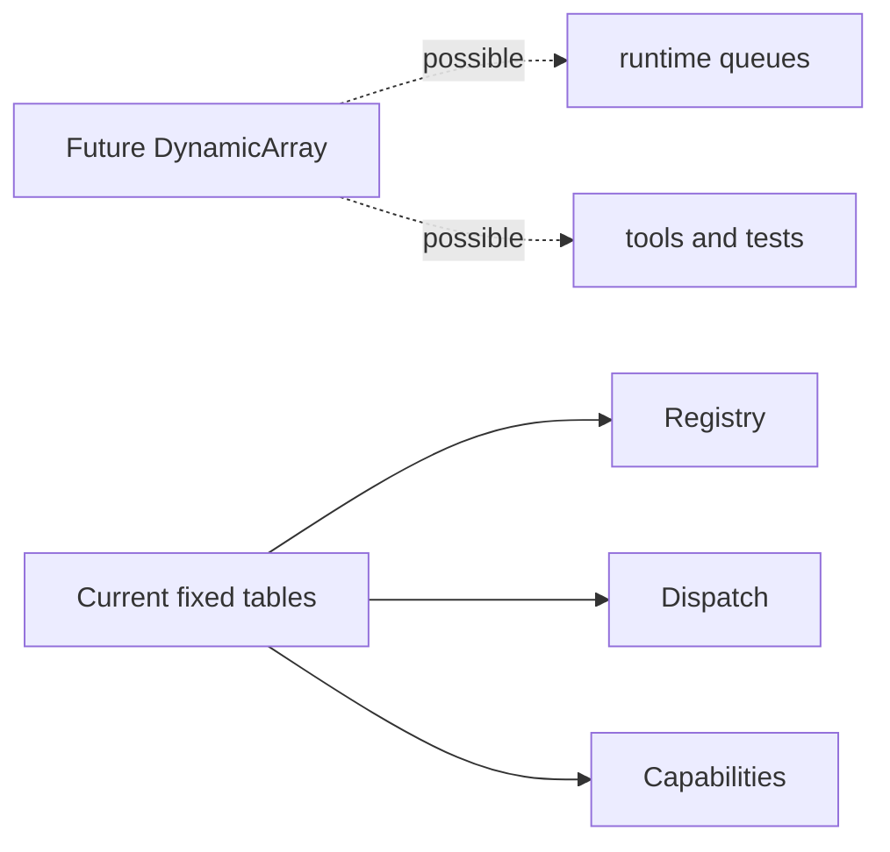
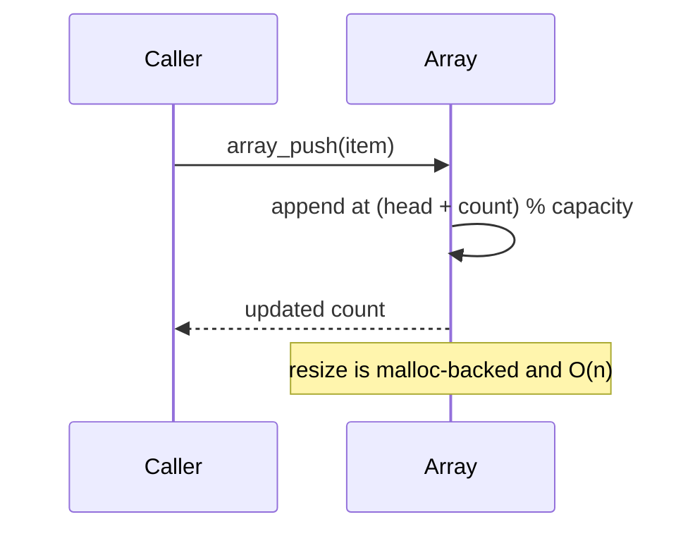

# Dynamic Array Status

## 1. What problem does this solve?

A fixed filing cabinet is predictable; a growing box can hold an unknown workload. A DynamicArray would be useful for queues and tools, but it is not present in this repository.

## 2. Actual project status

The repository now contains a generic circular DynamicArray under `shared/dynamic_array/`. It is implemented as a runtime/shared utility, but it is not included in the kernel CMake target and is not used by the communication paths.

```text
Current project:
fixed registry / fixed dispatch / fixed capability tables
                         |
                         +-- separate DynamicArray utility
```





## 3. Intended future semantics

A circular dynamic array in [shared/dynamic_array/dynamic_array.h](../shared/dynamic_array/dynamic_array.h) uses `head`, `count`, `capacity`, and `data`. `array_get()` and `array_set()` calculate `(head + index) % capacity` and are $O(1)$. `array_pop()` and `array_dequeue()` are $O(1)$. `array_push()` and `array_enqueue()` are amortized $O(1)$, with `resize()` occasionally performing an $O(n)$ copy and `malloc()`.

Suitable uses are runtime queues, work lists, traversal stacks, tooling, and tests. It must not replace the current fixed service registry, per-service dispatch table, capability table, or communication hot path because those require deterministic bounded behavior.

**Implementation note:** the utility stores `void *`, uses `malloc/free`, and calls `exit(EXIT_FAILURE)` on allocation failure. It is therefore not kernel-safe and is not part of `lettuce_kernel`. Its public functions are named `array_*`, not `lettuce_*`, because this is a separate generic utility rather than a Lettuce C ABI.

## Common misunderstanding

A DynamicArray is not automatically faster. Its resize and allocation behavior would be inappropriate for the current kernel fast path.

## How to remember this subsystem

The current design intentionally keeps DynamicArray separate. Use it where flexible collections matter; use fixed tables where predictable kernel lookup matters.

## Source files used in this chapter

- [CMakeLists.txt](../CMakeLists.txt)
- [kernel/main/kernel.c](../kernel/main/kernel.c)
- [kernel/main/capability.c](../kernel/main/capability.c)
- [kernel/main/dispatch.c](../kernel/main/dispatch.c)
- [shared/dynamic_array/dynamic_array.h](../shared/dynamic_array/dynamic_array.h)
- [shared/dynamic_array/dynamic_array.c](../shared/dynamic_array/dynamic_array.c)
