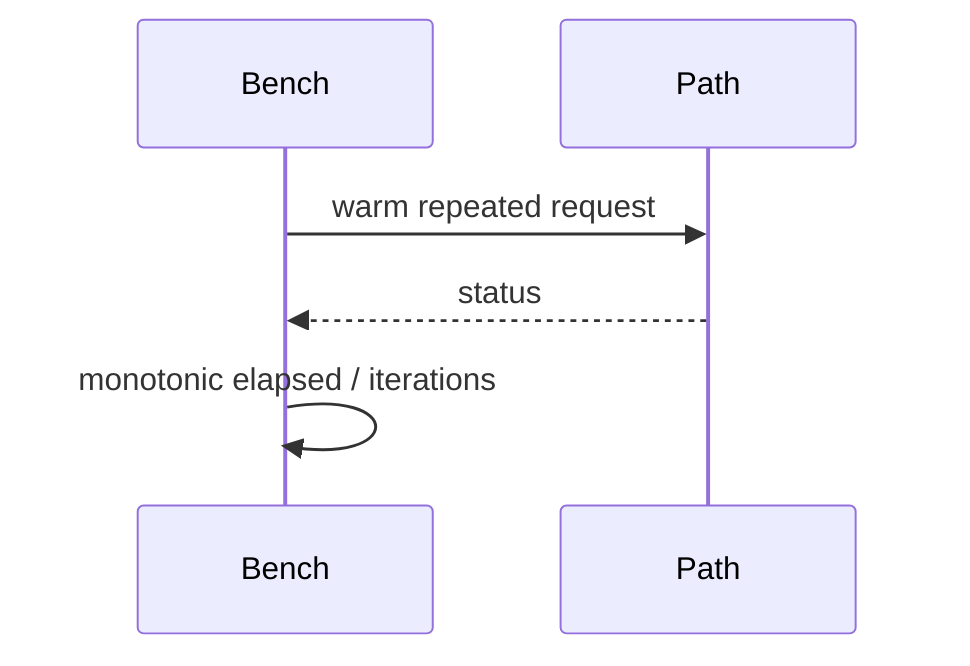

# Performance and Complexity

## 1. Why measure complexity?

A receptionist who checks one numbered drawer is predictable; one who walks every drawer gets slower as the building grows. Complexity describes that growth; benchmarks measure actual host timing.

```text
service lookup       O(1)
dispatch lookup       O(1)
capability check     O(1)
capability create    O(1) after O(n) init
same-layer call      bounded sequence of O(1) stages
```

```mermaid
flowchart LR
    Registry[O(1) registry] --> Dispatch[O(1) dispatch]
    Dispatch --> Cap[O(1) capability check]
    Cap --> Context[O(1) context transition]
```



## 2. Actual operations

Service lookup directly indexes up to 256 entries. Dispatch lookup directly indexes one of 64 operations inside that service. Capability check decodes one handle, reads one capability slot, and performs scalar comparisons. Capability creation pops a free slot; revoke pushes it back. Initialization scans all entries, so only initialization is $O(n)$.

Same-layer, cross-layer, and Elevator calls each perform a bounded number of lookups/checks and one context transition. Their target function cost is additional and workload-dependent. Shared-buffer creation scans at most 16 slots; access and revoke are $O(1)$.

A generic circular DynamicArray utility exists under `shared/dynamic_array/` for user-space and test tooling (amortized $O(1)$ push/pop), but it is strictly excluded from kernel hot paths.

## 3. Empirical Measurements

Host microbenchmarks execute across 1,000,000 iterations using `clock_gettime(CLOCK_MONOTONIC_RAW)` on the author's development machine (11th Gen Intel Core i5-1145G7 @ 2.60GHz, x86_64).

Canonical median latencies (p50) from tracked raw results:
- **Direct Function Call:** 2 ns
- **Capability Authorization Check:** 9 ns
- **Cross-Layer Mediated Call:** 35 ns
- **Elevator Critical Call:** 37 ns
- **Same-Layer Mediated Call:** 38 ns

For complete distributions (p50, p95, p99, mean, min, max) and scheduler evaluation, see:
- [results/raw/host/host-benchmarks.csv](../results/raw/host/host-benchmarks.csv)
- [docs/performance.md](performance.md)

### Distinction Between Host Nanoseconds and QEMU Virtual Ticks
- **Host Measurements (nanoseconds):** Measure the native host execution model via high-resolution monotonic time (`CLOCK_MONOTONIC_RAW`). They quantify logic overhead and must not be interpreted as ARM64 silicon performance.
- **ARM64 QEMU Measurements (Generic Counter ticks):** Freestanding ARM64 tests execute under QEMU TCG software emulation and read the virtual Generic Counter (`CNTVCT_EL0`). These ticks are emulator-relative and are **not directly comparable** to host nanoseconds or physical ARM64 hardware cycle counts.

## Common misunderstandings

$O(1)$ does not mean zero cost. Amortized $O(1)$ is not strict $O(1)$. A fixed table can use more reserved memory while reducing lookup variability.

## Source files used in this chapter

- [kernel/main/kernel.c](../kernel/main/kernel.c)
- [kernel/main/dispatch.c](../kernel/main/dispatch.c)
- [kernel/main/capability.c](../kernel/main/capability.c)
- [kernel/main/context.c](../kernel/main/context.c)
- [benchmarks/direct_call/direct_call_bench.c](../benchmarks/direct_call/direct_call_bench.c)
- [benchmarks/same_layer/same_layer_bench.c](../benchmarks/same_layer/same_layer_bench.c)
- [benchmarks/cross_layer/cross_layer_bench.c](../benchmarks/cross_layer/cross_layer_bench.c)
- [benchmarks/elevator/elevator_bench.c](../benchmarks/elevator/elevator_bench.c)
- [benchmarks/ipc/capability_bench.c](../benchmarks/ipc/capability_bench.c)
