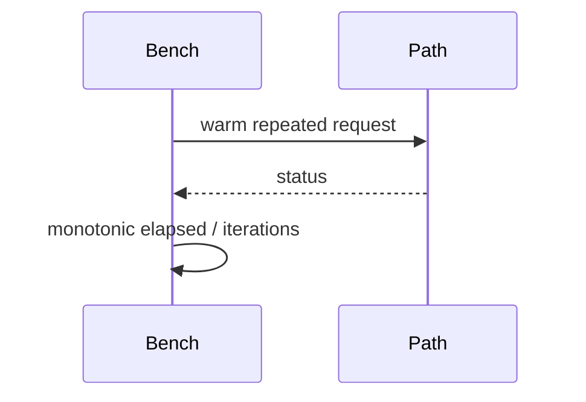

# Performance and Complexity

## 1. Why measure complexity?

A receptionist who checks one numbered drawer is predictable; one who walks every drawer gets slower as the building grows. Complexity describes that growth; benchmarks measure actual host timing.

```text
service lookup       O(1)
dispatch lookup       O(1)
capability check     O(1)
capability create    O(1) after O(n) init
same-layer call      bounded sequence of O(1) stages
```

```mermaid
flowchart LR
    Registry[O(1) registry] --> Dispatch[O(1) dispatch]
    Dispatch --> Cap[O(1) capability check]
    Cap --> Context[O(1) context transition]
```



## 2. Actual operations

Service lookup directly indexes up to 256 entries. Dispatch lookup directly indexes one of 64 operations inside that service. Capability check decodes one handle, reads one capability slot, and performs scalar comparisons. Capability creation pops a free slot; revoke pushes it back. Initialization scans all entries, so only initialization is $O(n)$.

Same-layer, cross-layer, and Elevator calls each perform a bounded number of lookups/checks and one context transition. Their target function cost is additional and workload-dependent. Shared-buffer creation scans at most 16 slots; access and revoke are $O(1)$.

No DynamicArray exists, so there is no current amortized push claim.

## 3. Host measurements

The benchmark programs use one million iterations and `CLOCK_MONOTONIC`. A representative run measured direct call 11 ns, capability check 22 ns, same-layer 168 ns, cross-layer 106 ns, and Elevator 99 ns. These values vary by host and compiler and are not ARM64 results.

## Common misunderstandings

$O(1)$ does not mean zero cost. Amortized $O(1)$ is not strict $O(1)$. A fixed table can use more reserved memory while reducing lookup variability.

## Source files used in this chapter

- [kernel/main/kernel.c](../kernel/main/kernel.c)
- [kernel/main/dispatch.c](../kernel/main/dispatch.c)
- [kernel/main/capability.c](../kernel/main/capability.c)
- [kernel/main/context.c](../kernel/main/context.c)
- [benchmarks/direct_call/direct_call_bench.c](../benchmarks/direct_call/direct_call_bench.c)
- [benchmarks/same_layer/same_layer_bench.c](../benchmarks/same_layer/same_layer_bench.c)
- [benchmarks/cross_layer/cross_layer_bench.c](../benchmarks/cross_layer/cross_layer_bench.c)
- [benchmarks/elevator/elevator_bench.c](../benchmarks/elevator/elevator_bench.c)
- [benchmarks/ipc/capability_bench.c](../benchmarks/ipc/capability_bench.c)
