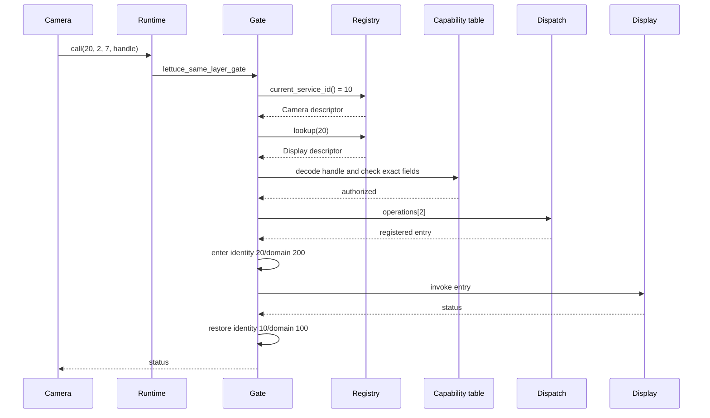
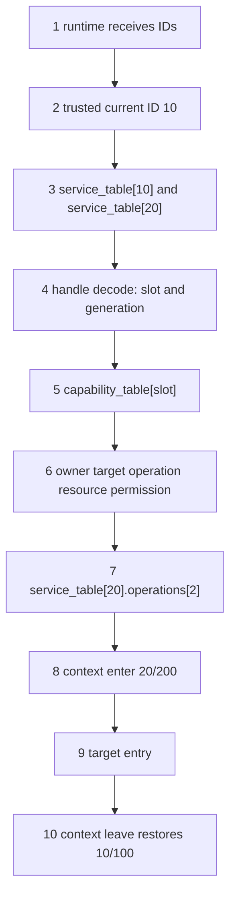

# End-to-End Walkthrough: Camera to Display

## 1. Scenario

Camera is service 10, layer L3, domain 100. Display is service 20, layer L3, domain 200. `SubmitFrame` is operation 2. Resource `FrameBuffer7` is resource 7. The capability contains owner 10, target 20, operation 2, resource 7, and `CALL`.

```text
Camera 10/L3/D100
  -> runtime wrapper
  -> same-layer validator and gate
  -> Display 20/L3/D200 operation 2
  -> restore Camera 10/L3/D100
```





## 2. Detailed trace

1. `runtime/c/same_layer_call.c` receives target 20, operation 2, resource 7, and an opaque handle.
2. `ipc/same_layer/gate.c` calls validation; no caller ID is supplied.
3. `current_service_id()` returns 10.
4. `kernel/main/kernel.c` directly reads `service_table[10]` and `[20]`.
5. The validator checks both active and equal L3 layers.
6. `kernel/main/capability.c` decodes the handle into a slot and generation.
7. It checks active state and generation, then trusted owner 10, target 20, operation 2, resource 7, and `CALL`.
8. Dispatch reads `operations[2]` inside service 20.
9. `lettuce_context_enter(20, 200)` stores `{10,100}`, changes identity/domain, and the Display entry runs.
10. The gate calls `lettuce_context_leave`, restoring `{10,100}` even when the target returns an error.

## 3. Common misunderstanding

A successful capability does not directly contain Display's function address. The kernel's dispatch table supplies the registered entry. A same-layer call does not mean shared memory or absent isolation.

## Complexity table

| Stage | Complexity |
|---|---:|
| registry lookup | $O(1)$ |
| capability check | $O(1)$ |
| dispatch lookup | $O(1)$ |
| context transition | $O(1)$ |

## How to remember this path

The request names a destination and action. Trusted context supplies caller identity. Capability proves authorization. Dispatch supplies code. Context changes and then restores both identity and domain.

## Source files used in this chapter

- [runtime/c/same_layer_call.c](../runtime/c/same_layer_call.c)
- [ipc/same_layer/gate.c](../ipc/same_layer/gate.c)
- [ipc/same_layer/validate.c](../ipc/same_layer/validate.c)
- [kernel/main/capability.c](../kernel/main/capability.c)
- [kernel/main/dispatch.c](../kernel/main/dispatch.c)
- [kernel/main/context.c](../kernel/main/context.c)
- [kernel/main/protection.c](../kernel/main/protection.c)
