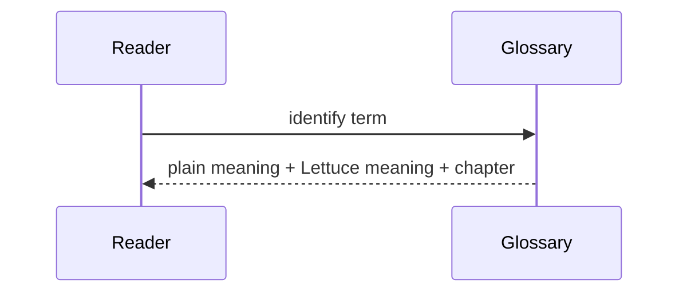

# Glossary

- **ABI:** Plain: binary agreement between separately compiled code. Lettuce: fixed-width IDs, status values, and 16-byte call messages crossing C boundaries; see [10-call-message.md](10-call-message.md).
- **Alignment:** Plain: address suitability for a type. Lettuce: ordinary compiler alignment used by descriptors and entries.
- **Offset:** Plain: byte position within a struct. Lettuce: descriptor fields are at offsets 0, 4, 8, and 12.
- **Padding:** Plain: compiler-inserted/reserved bytes. Lettuce: three reserved bytes after `LettuceLayer` preserve the next 32-bit field boundary.
- **Bitmask:** Plain: flags packed into bits. Lettuce: capability permissions such as `CALL | CRITICAL`.
- **Pointer:** Plain: value naming a memory address. Lettuce: C pointers return descriptors or entries; they are not user authorization.
- **Function pointer:** Plain: address of callable code. Lettuce: stored only in kernel-owned dispatch registrations.
- **Static storage:** Plain: memory with fixed program lifetime. Lettuce: service, capability, buffer, and free-slot arrays.
- **Registry:** Directory of known services; implemented in [kernel/main/kernel.c](../kernel/main/kernel.c).
- **Service ID:** Fixed `uint32_t` identity used as a bounded registry index.
- **Operation ID:** Fixed `uint32_t` menu-item number selecting one per-service operation.
- **Resource ID:** Fixed `uint32_t` identifier for a protected resource.
- **Capability:** Kernel-owned authorization record.
- **Handle:** Opaque 32-bit reference to a capability or buffer record.
- **Slot:** Table position encoded into a handle.
- **Generation:** Version incremented on reuse to reject stale handles.
- **Stale handle:** Old handle whose generation no longer matches.
- **Revocation:** Invalidating an active capability or buffer handle.
- **Dispatch:** Resolving service/operation IDs to a registered entry.
- **Layer:** Architectural classification, L1 through L4; not a memory boundary.
- **Domain:** Logical protection context associated with a service.
- **Execution context:** Current service identity plus current logical domain.
- **Same-layer:** Path requiring equal caller and target layers.
- **Cross-layer:** Direct path requiring unequal layers; no mandatory hops.
- **Elevator:** Critical path requiring exact `CALL | CRITICAL` permission.
- **Hot path:** Frequently executed successful communication route.
- **O(1):** Bounded work independent of table population; current direct lookups/checks use it.
- **Amortized O(1):** Average sequence cost; used by the shared DynamicArray utility.
- **FFI:** Foreign Function Interface; Rust's `unsafe extern "C"` boundary.
- **MMU:** Hardware virtual-memory protection mechanism; implemented in the ARM64 supervisor using 4 KiB granules and 16-bit ASIDs.
- **PAC:** Pointer Authentication; implemented in the ARM64 supervisor (`pacia`/`autia`) protecting call-gate continuation state.
- **MTE:** Memory Tagging Extension; probed via system registers; unbacked by tag RAM in the evaluated QEMU configuration.
- **POE:** Permission Overlay Extension; probed via ID registers and reported as unsupported; no fake software emulation.

## Source files used in this chapter

- [include/lettuce/types.h](../include/lettuce/types.h)
- [include/lettuce/service.h](../include/lettuce/service.h)
- [include/lettuce/capability.h](../include/lettuce/capability.h)
- [kernel/include/context.h](../kernel/include/context.h)
